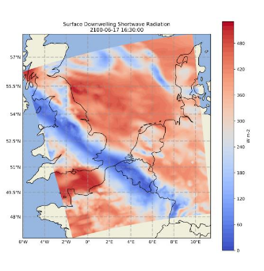

# Deltares-Climate-Change

  

Warning: Since the dataset Deltares provided us with is too big to just upload here, I recommend to just store the data locally in a separate folder or ignore the specific directory (see https://stackoverflow.com/questions/343646/ignoring-directories-in-git-repositories-on-windows) to prevent uploading the data whenever you push your local changes.

Okay so here is a quick Git tutorial in case you are using the command line:

    git status For checking (locally) what files have changed

    git add . For adding things (in this case everything because of the ".") to the staging area (locally)

    git commit For commiting (i.e. writing into the database) everything that has been added to the staging area

    git push For uploading the committed stuff to the server
